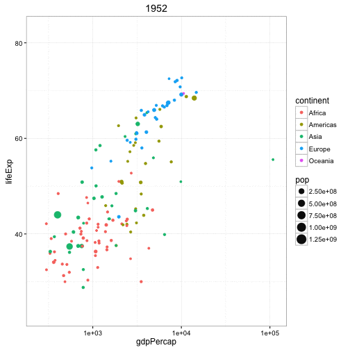
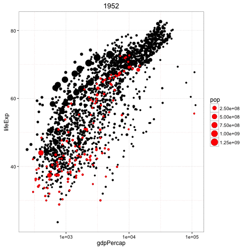
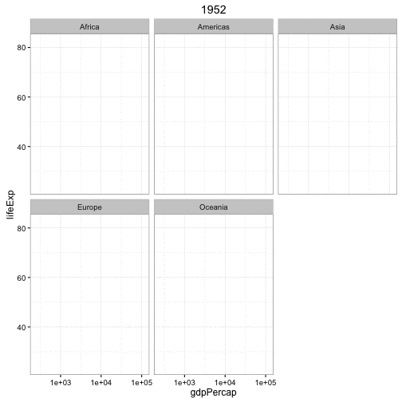
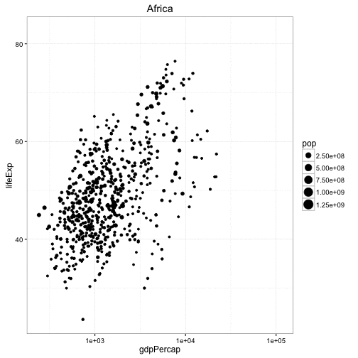

## gganimate: Create easy animations with ggplot2

<!-- README.md is generated from README.Rmd. Please edit that file -->


**gganimate** wraps the [animation package](http://www.inside-r.org/packages/cran/animation/docs/animation) to create animated ggplot2 plots. It can be installed using [devtools](https://github.com/hadley/devtools):

```
devtools::install_github("dgrtwo/gganimate")
```

The core of the approach is to treat "frame" (as in, the time point within an animation) as another aesthetic, just like **x**, **y**, **size**, **color**, or so on. Thus, a variable in your data can be mapped to frame just as others are mapped to x or y.

For example, suppose we wanted to create an animation similar to the [Gapminder world](http://www.gapminder.org/world) animation, using Jenny Bryan's [gapminder](https://github.com/jennybc/gapminder) package for the data.


```r
library(gapminder)
library(ggplot2)
theme_set(theme_bw())
```


```r
p <- ggplot(gapminder, aes(gdpPercap, lifeExp, size = pop, color = continent, frame = year)) +
  geom_point() +
  scale_x_log10()
```

Notice we added `frame = year` and saved the plot as `p`. We then display it as an animation with the `gg_animate` function:


```r
library(gganimate)

gg_animate(p)
```



This displays each of the frames of the plot in sequence (note that if you're running it interactively it will be too fast to see all of them). When combined with knitr's `fig.show = "animate"`, we create an animation as seen above.

You can also save the animation to a file, such as an GIF, video, or an animated webpage:


```r
gg_animate(p, "output.gif")
gg_animate(p, "output.mp4")
gg_animate(p, "output.swf")
gg_animate(p, "output.html")
```

(Each of these requires ffmpeg, ImageMagick, or other such drivers to be installed on your computer: see the [animation package](http://www.inside-r.org/packages/cran/animation/docs/animation) documentation for more).

Notice that the axis limits and legend stay fixed between animation frames, even though the points move. This is one of the advantages of the **gganimate** package as opposed to creating each ggplot separately and combining them with the **animation** package: the plot (with its axes and legend) is built only once but rendered for each frame.

### Customization

You can have some layers of your plot animated and others not, simply by adding the `frame` aesthetic to those layers and not others. This is useful, for example, if you want to *highlight* particular points in an animation rather than move them. 


```r
p <- ggplot(gapminder, aes(gdpPercap, lifeExp, size = pop)) +
  geom_point() +
  geom_point(aes(frame = year), color = "red") +
  scale_x_log10()

gg_animate(p)
```



Note that while it's intuitive to match `frame` to a "time" dimension, you could match any variable in your data to the `frame` aesthetic. We could animate across continents instead:


```r
p <- ggplot(gapminder, aes(gdpPercap, lifeExp, size = pop, frame = continent)) +
  geom_point() +
  scale_x_log10()

gg_animate(p)
```



Note that if there is a stat summarization (such as a `geom_smooth`) that you want to animate, you should also add a `group` aesthetic to that layer. Otherwise, the layer will be calculated once across all frames (and therefore be constant in the animation):


```r
p <- ggplot(gapminder, aes(gdpPercap, lifeExp, size = pop, frame = year)) +
  geom_point() +
  geom_smooth(aes(group = year), method = "lm", show.legend = FALSE) +
  facet_wrap(~ continent, scales = "free") +
  scale_x_log10()

gg_animate(p)
```



Finally, note that you can control your animation the same way you would in the animation package, using the [ani.options](http://www.inside-r.org/packages/cran/animation/docs/ani.options) function:


```r
library(animation)
ani.options(interval = .3)
gg_animate(p, "output.mp4")
```

